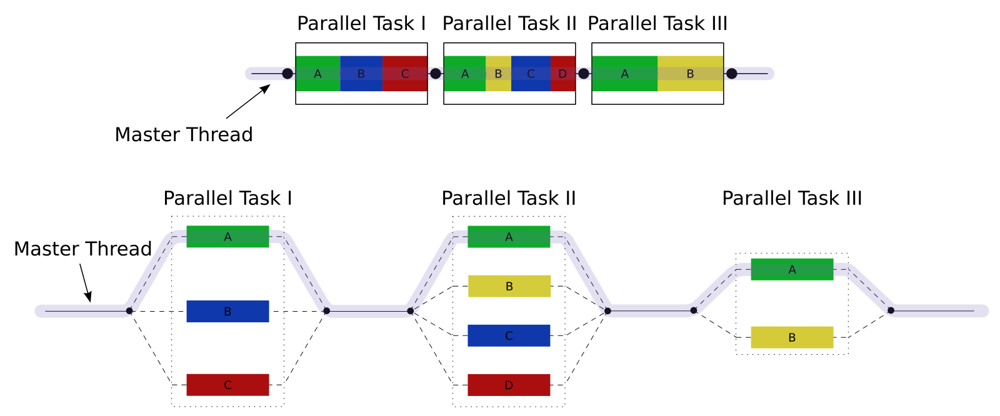
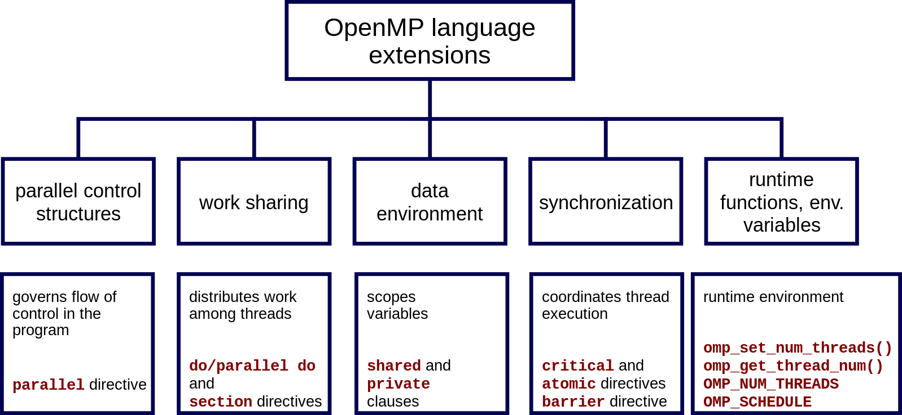

# OpenMP_CPP

*Note: pictures from [Wikipedia](https://en.wikipedia.org/wiki/OpenMP)* 

**Exploring OpenMP usage with (modern) C++.**

The [OpenMP (Open Multi-Processing) API](https://en.wikipedia.org/wiki/OpenMP) supports multi-platform shared-memory 
multiprocessing programming in C, C++, and Fortran. It consists of a set of 
**compiler directives**, **library routines**, and **environment variables** that 
influence run-time behavior.

## Links

* [OpenMP 4.0](https://www.openmp.org//wp-content/uploads/OpenMP4.0.0.pdf)
* [OpenMP C/C++ Cheatsheet](https://www.openmp.org/wp-content/uploads/OpenMP-4.5-1115-CPP-web.pdf)
* [OpenMP C++](https://www.openmp.org/wp-content/uploads/OpenMP-4.5-1115-CPP-web.pdf)
* [OpenMP Tutorial](https://computing.llnl.gov/tutorials/openMP/)
* [Compiler support C++](https://www.openmp.org//resources/openmp-compilers-tools/)
* [OpenMP how to](https://bisqwit.iki.fi/story/howto/openmp/)

## Project 

### Content

* **src/hello_world.cpp**: simple hello_world example function using OpenMP
* **src/Basics.cpp**: basic examples for parallel (for), sections, simd constructs
* **src/RuntimeLibraryRoutines.cpp**: Runtime library routines 

### Examples

* See [OpenMP examples 4.5.0 (PDF)](resources/openmp-examples-4.5.0.pdf) 
    * alternatively: [weblink](https://www.openmp.org//wp-content/uploads/openmp-examples-4.5.0.pdf)

## OpenMP

OpenMP (**Open Multi-Processing** as a Shared-Memory Parallel Programming Model) is the de-facto standard 
for shared-memory parallelization, thus for multicore systems. OpenMP programs start with one thread (the Master) and 
Worker threads are spawned at Parallel Regions together with the Master forming a Team of threads. 
In between Parallel Regions Worker threads are put to sleep.

### Programming model

OpenMP establishes a simple and limited set of directives for programming shared memory machines, implemented by just a few directives.

The programming model includes:

* **Shared Memory Model:** designed for multi-processor/core, shared memory machines
* **Thread Based Parallelism:** programs accomplish parallelism exclusively through the use of threads
* **Explicit Parallelism:** provides explicit (not automatic) parallelism, offering full control over parallelization
* **Compiler Directive Based:** Parallelism is specified through the use of compiler directives embedded in the code
* **I/O:** OpenMP does not specify parallel I/O, therefore it is up to the programmer to ensure that I/O is conducted correctly
* **MPI:** MPI and OpenMP can interoperate to create a hybrid model of parallelism

### Components 

Components of OpenMP embraces:

* **Compiler Directives** (Pragma) appear as comments in the code and are completely ignored by compilers unless otherwise stated by specifying appropriate compiler flags (GNU: -fopenmp). The compiler directives are used to spawn a parallel region, dividing blocks of code among threads, distributing loop iterations among threads, synchronize
work among threads
* **Runtime Library Routines** are used to set and query number of threads, query threads unique identifier and the thread pool size
* **Environment Variables** are used to control execution of parallel code at run-time, thus for setting the number of threads, specifying how loop iterations are divided and enabling/disabling dynamic threads

